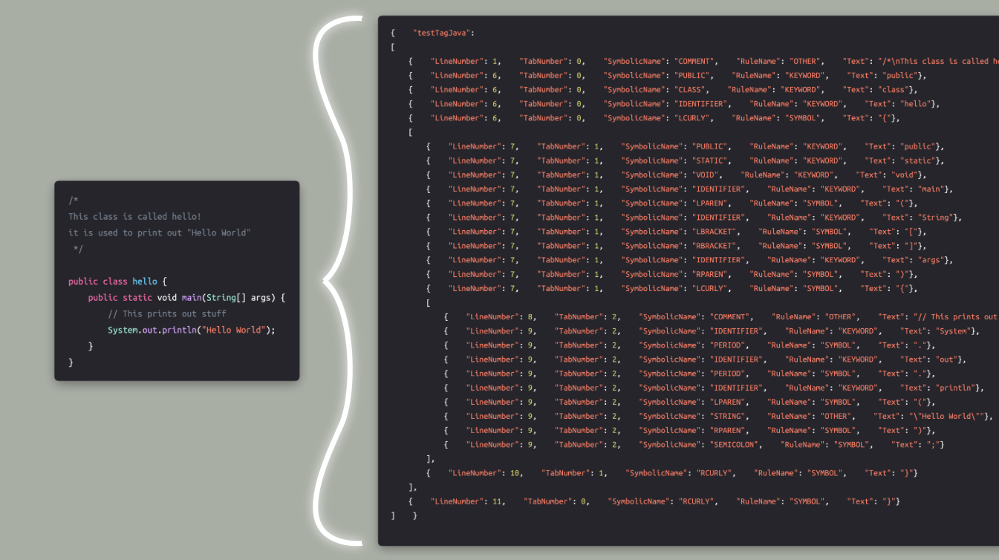

# scopenizer-tokenizer


A tokenizer written purely in Go... which also can find scope!


## Motivation

This project's main goal is to combine the tasks
of finding the tokens within a programming language along with
distinguishing where scopes begin/end. Despite this being the
goal, the scopenizer tokenizer can be utilized for other parsing type tasks.

Here is an example of the results that would result from applying the scopenizer on a piece of java code.
The tokens are split up by keywords and symbols, and are placed in a scope object when encountering, well, a scope
(indicated by curly brackets in Java). The results we are seeing here is the scope object converted to JSON.


> image partially created using [Codye for Mac](https://apps.apple.com/us/app/codye/id1516894961)

This scoped/tokenized code had the initial goal of being used to determine 
the cyclomatic and cognitive complexity of a piece of code. With it being initially scoped like this,
things like the nesting count for cognitive complexity can be derived from the structure instead of parsed.

## Installation

```
TODO
```


## Usage


## LICENSE

MIT License

[See License](https://github.com/mccoyJosh/scopenizer-tokenizer/blob/main/LICENSE)
